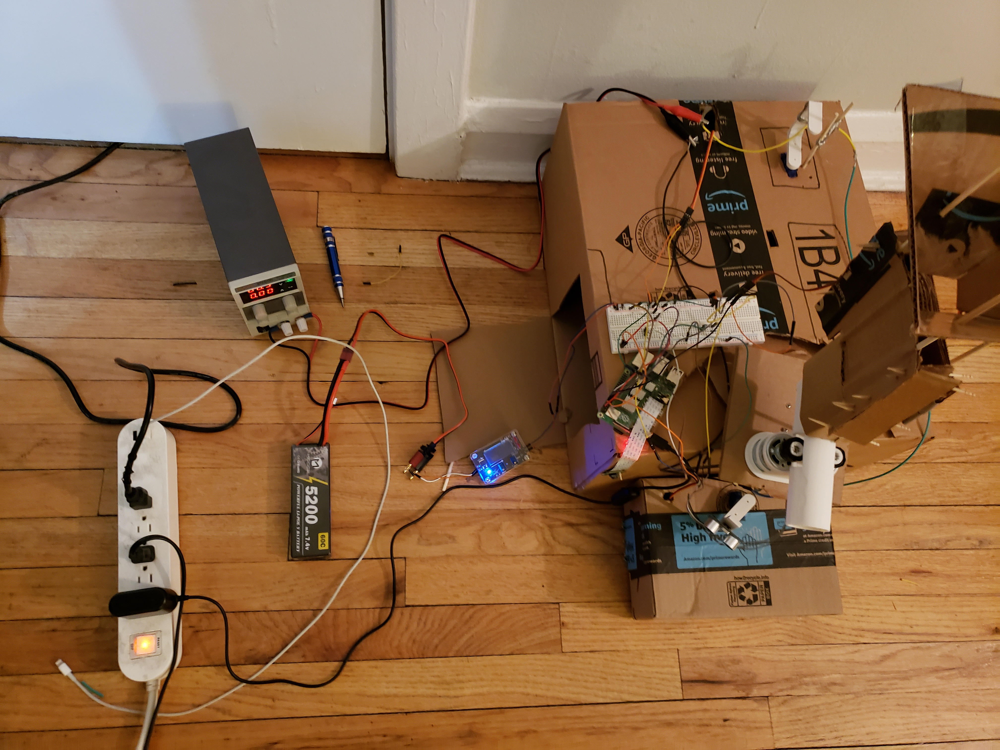
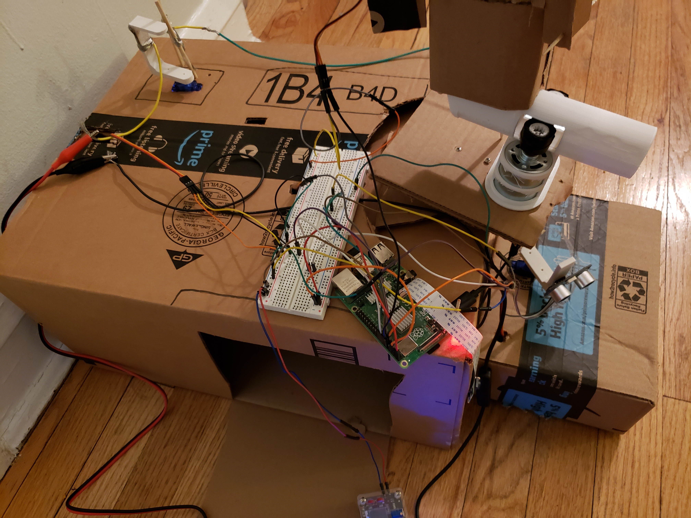

# Pi-Radar
A system that takes a picture of a moving object and uploads the picture to an embedded web server. 

<html>
  
The system uses an ultrasonic sensor as a radar that moves from 0 to 180 degrees with the help of a servo motor. If the radar detects an object within 1 meter, it will stop and communicate its current position to the Raspberry Pi. The Pi camera will take a picture of the object which is uploaded on the webserver hosted on Apache (a hosting service that is integrated in the Pi). The Pi will then send the position of the object to the servo motor controlling the semi-automatic gun and the gun will fire at the target.
  
  <b>captureImage.py</b> will be executed by the program on the pi terminal and capture an image of the moving object.   
  <b>final.php and mywebpage.php</b> handle the web server and each components linked to the pi.  
  <b>send_sms.py </b> will send a message on my phone saying that there was an object detected and shot, with a link to the webserver to see a picture of the object.  

Here are some pictures of the system: 
 
 
 
 
</html>
